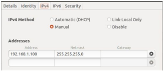
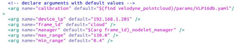
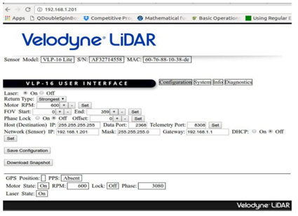
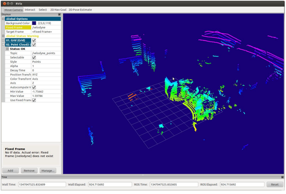
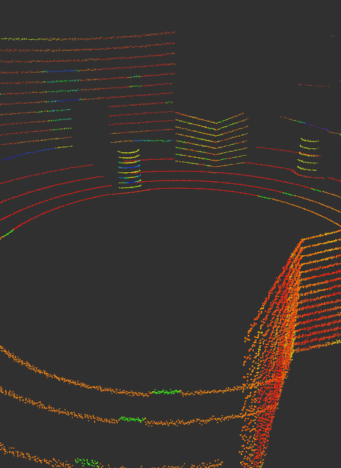
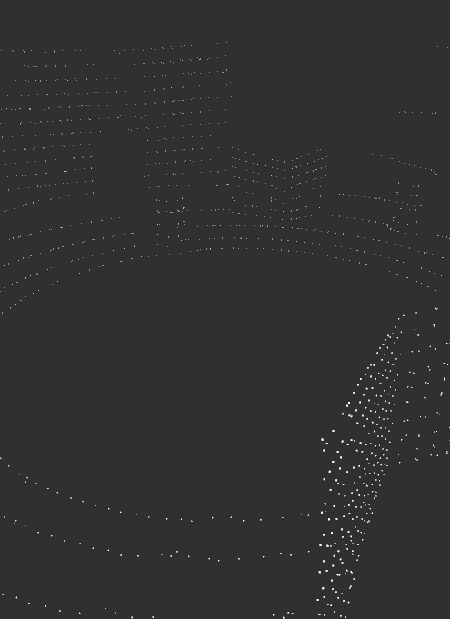
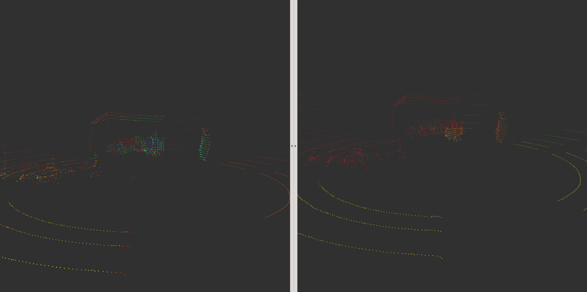
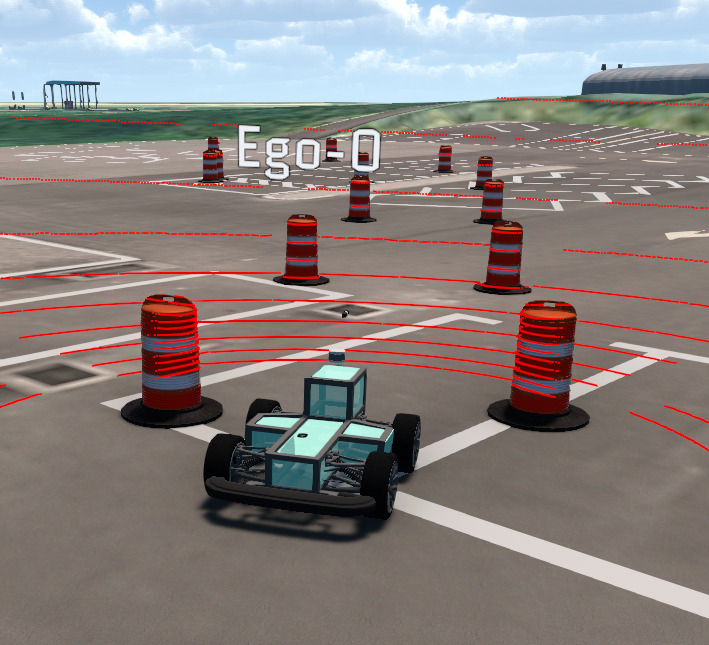
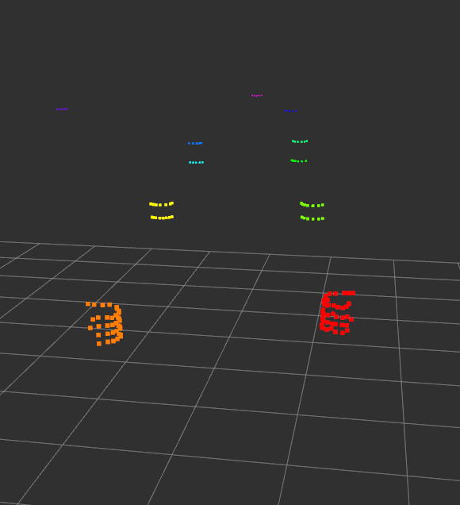

# LiDAR

## 1. LiDAR Setting

### 1.1 Port setting
외부 장치(센서)를 사용하는 프로그램 실행 전에 반드시 장치(센서)에 연결된 포트의 권한을 수정해주어야 한다. `dev.py` 프로그램을 이용하면 연결된 장치의 목록을 확인할 수 있다.

~~~
$ cd ~/carvis/src
$ python dev.py
~~~

센서가 연결된 포트를 확인하고 권한을 수정해준다.

~~~
$ sudo chmod 777 /dev/tty* # 해당 포트
~~~

### 1.2 Velodyne VLP-16 setting
Velodyne VLP-16 LiDAR는 LAN 포트를 통한 UDP 통신으로 데이터를 주고받을 수 있다. UDP 통신을 사용하기 위해 네트워크 세팅이 필요하다.  
설정 -> Network 에서 wired connection을 확인하여 VLP-16과 연결된 port의 네트워크 설정을 연다. 설정에서 IPv4 Method를 Manual로 설정하고 아래와 같이 Address와 Netmask를 입력한다. Address의 경우 192.168.1.xxx로 xxx의 자리에 이미 사용하고 있는 IP를 제외하고 설정한다. (1, 201, 255 등은 제외한다.) 설정한 IP는 해당 네트워크에서 컴퓨터의 IP가 된다.



설정 후 네트워크를 재시작한 후 아래 명령어를 통해 패키지를 실행하여 동작하는 것을 확인한다.

~~~
$ roslaunch velodyne_pointcloud VLP16_points.launch
~~~

패키지의 경로로 들어가 VLP16_points launch를 열어 device_ip를 확인한다. 해당 IP는 네트워크에서 VLP-16의 IP이다. (default 192.168.1.201)



브라우저를 열어 위에서 확인한 VLP-16의 IP(192.168.1.201)를 입력하여 RPM, FOV, HOST IP 등을 변경할 수 있다. 아래 사진과 같이 설정한다.



새 터미널을 열어 `$ rviz` 입력 후 `Add` -> `topic` 에서 velodyne_pointcloud를 찾아 추가한 후 Fixed Frame을 velodyne으로 변경하면 다음과 같이 pointcloud를 확인할 수 있다. 



## 2. Basic LiDAR Processing
## 2.1 Voxel filtering

일반적으로 pointcloud는 처리해야 할 데이터가 크기 때문에 데이터를 간소화하기 위하여 voxel filtering을 실시한다. Voxel filtering이란 일정 leaf size 이내의 point들을 한 대표 point로 표현하여 voxelize하는 것이다. Voxel filter를 적용한 결과는 다음과 같다. 촘촘한 point 들이 일정 간격을 두고 떨어져있어 point의 개수가 줄어든 것을 확인할 수 있다.




## 2.2 Euclidean clustering

Euclidean clustering은 거리 기반 clustering method로 일정한 euclidean distance 이내의 점들을 하나의 cluster로 간주하는 방법이다. Euclidean clustering을 설정한 결과는 다음과 같다. 왼쪽은 voxelize한 pointcloud이고 오른쪽이 euclidean cluster한 결과이다.



위와 같이 지면을 제거하지 않으면 일정 거리 이내로 이어져 있는 지면이 한 cluster로 묶여 지면과 붙어있는 물체까지 한 cluster로 묶이는 단점이 있다. 따라서 ROI를 설정하거나 RANSAC을 이용하여 지면을 제거하여야 좋은 결과를 얻을 수 있다. 추가로 DBSCAN 등과 같은 다른 밀도 기반 clustering method를 쓰면 더욱 좋은 결과를 얻을 수 있다.

## 2.3 Usage

`carvis/src/lidar/src/lidar_filter.cpp` 를 열어 Voxel filtering 할 leaf size, ROI, Euclidean cluster parameter를 설정해 준다.

```
41  sor.setLeafSize(0.1, 0.1, 0.1);     // leaf size of voxel
51  passz.setFilterLimits (-0.3, 999);  // z-axis ROI, down 0.3m, up 999m
56  passy.setFilterLimits (-10, 10);    // y-axis ROI, left 10m, right 10m
61  passx.setFilterLimits (-3, 30);     // x-axis ROI, back 3m, front 30m
77  ec.setClusterTolerance (0.6);       // Euclidean cluster tolerance
78  ec.setMinClusterSize (5);           // Minimum clustered voxel
79  ec.setMaxClusterSize (2000);        // Maximum clustered voxel
```

다음 명령을 통해 lidar package를 build한 후

```
$ cd ~/catkin_ws
$ catkin build lidar
```

다음 명령을 통해 filtering과 clustering을 수행할 수 있다.

```
$ roslaunch velodyne_pointcloud VLP16_points.launch &
$ rosrun lidar lidar_filter
```

## 2.4 Result
아래는 MORAI simulation 상에서 얻은 pointcloud를 voxelize하여 간소화 한 후 ROI를 통해 지면을 제거하고 euclidean clustering을 한 결과이다.




Cluster는 intensity를 통해 각각 다른 색으로 표현된다. Cone들이 잘 clustering된 것을 확인할 수 있다.

## 3. Adaptive LiDAR Clustering

### 3.1 Usage

`adaptive_clustering.cpp` 파일에서 라이다 데이터 ROI 설정이 가능하다. 

~~~
$ cd ~/catkin_ws/src/adaptive_clustering/src
$ gedit adaptive_clustering.cpp 
~~~

~~~
75      if(d2 > range * range && d2 <= (range+regions_[j]) * (range+ regions_[j]) && \
            x2 < 5 && x2 > 0 && y2 < 0 && y2 > -1.5) {
76          indices_array[j].push_back((*pc_indices)[i]);
77          break;
78      }
79      range += regions_[j];
80  }
~~~

위 코드를 보면 x2 변수가 라이다 x방향 범위 제한이고 y2 변수가 라이다 y방향 범위 제한 내용이다. 위의 예시에서 라이다 x, y 범위는 0 < x < 5 , -1.5 < y < 0 범위이다. 실험 결과 y 범위를 회전하는 방향쪽으로 주어야(위의 경우는 시계 방향으로 회전한다 가정) Track Driving이 잘 동작했다. 반시계 방향으로 회전한다면 y 범위를 반대로 바꾸어주는 것이 좋다.

~~~
278  private_nh.param<float>("z_axis_min", z_axis_min_, -0.8);
279  private_nh.param<float>("z_axis_max", z_axis_max_, 2.0);
280  private_nh.param<int>("cluster_size_min", cluster_size_min_, 3);
281  private_nh.param<int>("cluster_size_max", cluster_size_max_, 2200000);
~~~

위의 코드는, point들의 z방향 범위 제한과 cluster size 제한에 관한 내용이다. 위의 예시에서 z 범위는 -0.8 < z < 2.0, cluster size는 3 < cluster_size < 2200000 이다. 내용 수정 후 build하여야 변경 내용이 저장된다.

~~~
$ cd ~/catkin_ws
$ catkin build adaptive_clustering
~~~

~~~
$ roslaunch velodyne_pointcloud VLP16_
~~~