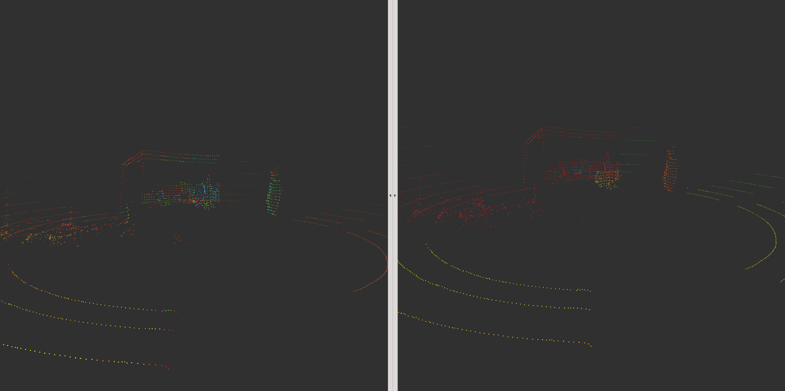

# LiDAR

## 1. Voxel filtering

## 2. Euclidean clustering

## 3. Usage
`carvis/src/lidar/src/lidar_filter.cpp` 를 열어 Voxel filtering 할 leaf size, ROI, Euclidean cluster parameter를 설정해 준다.
~~~
41  sor.setLeafSize(0.1, 0.1, 0.1);     // leaf size of voxel
51  passz.setFilterLimits (-0.3, 999);  // z-axis ROI, down 0.3m, up 999m
56  passy.setFilterLimits (-10, 10);    // y-axis ROI, left 10m, right 10m
61  passx.setFilterLimits (-3, 30);     // x-axis ROI, back 3m, front 30m
77  ec.setClusterTolerance (0.6);       // Euclidean cluster tolerance
78  ec.setMinClusterSize (5);           // Minimum clustered voxel
79  ec.setMaxClusterSize (2000);        // Maximum clustered voxel
~~~
다음 명령을 통해 lidar package를 build한 후
~~~
$ cd ~/catkin_ws
$ catkin build lidar
~~~

다음 명령을 통해 filtering과 clustering을 수행할 수 있다.
~~~
$ roslaunch velodyne_pointcloud VLP16_points.launch &
$ rosrun lidar lidar_filter
~~~

## 4. Result

