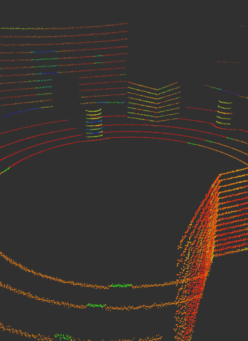
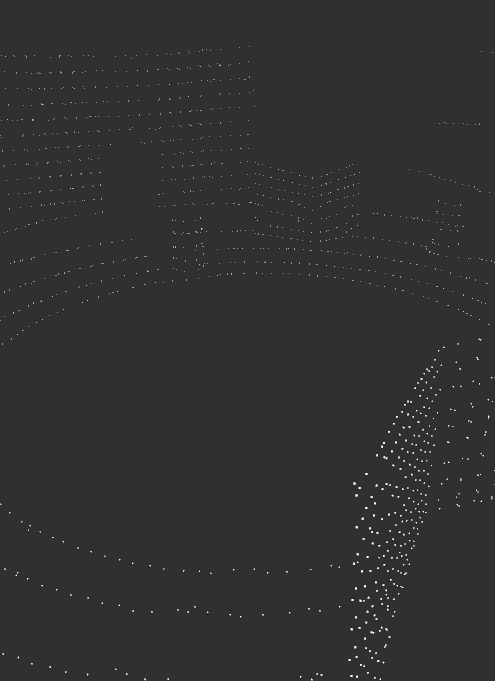
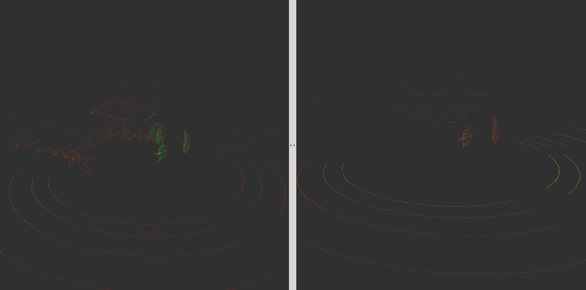
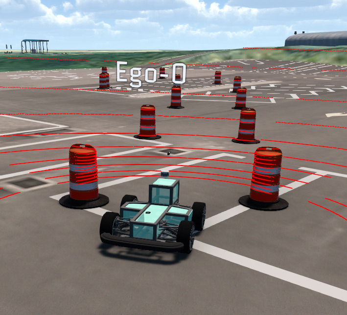
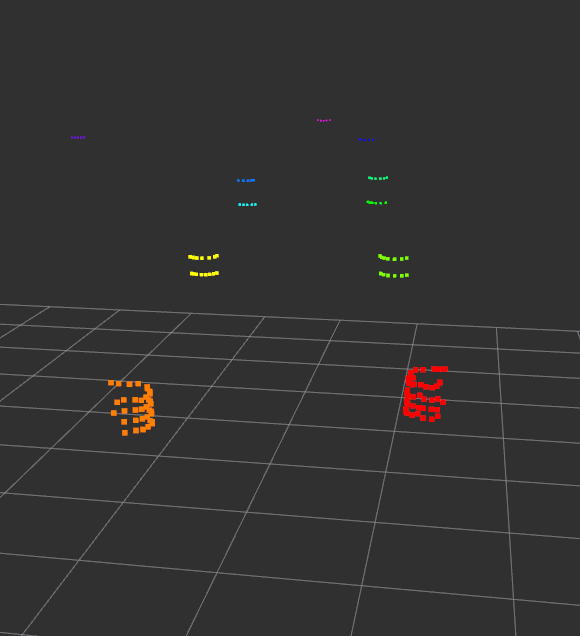

# LiDAR

## 1. Voxel filtering

일반적으로 pointcloud는 처리해야 할 데이터가 크기 때문에 데이터를 간소화하기 위하여 voxel filtering을 실시한다. Voxel filtering이란 일정 leaf size 이내의 point들을 한 대표 point로 표현하여 voxelize하는 것이다. Voxel filter를 적용한 결과는 다음과 같다. 촘촘한 point 들이 일정 간격을 두고 떨어져있어 point의 개수가 줄어든 것을 확인할 수 있다.




## 2. Euclidean clustering

Euclidean clustering은 거리 기반 clustering method로 일정한 euclidean distance 이내의 점들을 하나의 cluster로 간주하는 방법이다. Euclidean clustering을 설정한 결과는 다음과 같다. 왼쪽은 voxelize한 pointcloud이고 오른쪽이 euclidean cluster한 결과이다.



위와 같이 지면을 제거하지 않으면 일정 거리 이내로 이어져 있는 지면이 한 cluster로 묶여 지면과 붙어있는 물체까지 한 cluster로 묶이는 단점이 있다. 따라서 ROI를 설정하거나 RANSAC을 이용하여 지면을 제거하여야 좋은 결과를 얻을 수 있다. 추가로 DBSCAN 등과 같은 다른 밀도 기반 clustering method를 쓰면 더욱 좋은 결과를 얻을 수 있다.

## 3. Usage

`carvis/src/lidar/src/lidar_filter.cpp` 를 열어 Voxel filtering 할 leaf size, ROI, Euclidean cluster parameter를 설정해 준다.

```
41  sor.setLeafSize(0.1, 0.1, 0.1);     // leaf size of voxel
51  passz.setFilterLimits (-0.3, 999);  // z-axis ROI, down 0.3m, up 999m
56  passy.setFilterLimits (-10, 10);    // y-axis ROI, left 10m, right 10m
61  passx.setFilterLimits (-3, 30);     // x-axis ROI, back 3m, front 30m
77  ec.setClusterTolerance (0.6);       // Euclidean cluster tolerance
78  ec.setMinClusterSize (5);           // Minimum clustered voxel
79  ec.setMaxClusterSize (2000);        // Maximum clustered voxel
```

다음 명령을 통해 lidar package를 build한 후

```
$ cd ~/catkin_ws
$ catkin build lidar
```

다음 명령을 통해 filtering과 clustering을 수행할 수 있다.

```
$ roslaunch velodyne_pointcloud VLP16_points.launch &
$ rosrun lidar lidar_filter
```

## 4. Result
아래는 MORAI simulation 상에서 얻은 pointcloud를 voxelize하여 간소화 한 후 ROI를 통해 지면을 제거하고 euclidean clustering을 한 결과이다.




Cluster는 intensity를 통해 각각 다른 색으로 표현된다. Cone들이 잘 clustering된 것을 확인할 수 있다.