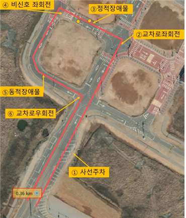

# Mission

## 1. Backup topic with Rosbag

Rosbag을 이용하면 지정한 topic의 정보를 녹화하거나 재생할 수 있다.
현장에서 rosbag을 이용하여 topic을 저장한 뒤, bag 파일을 재생하여 재현 및 debug가 가능하다.
다음과 같이 녹화할 topic을 지정하여 bag_record.launch 파일을 생성하여 실행하면 rosbag에 해당 토픽을 담아 추후에 재생할 수 있다.

```
<launch>
  <node pkg="rosbag" type="record" name="rosbag" 
    args="-o /home/car/bag/ 
        /velodyne_points
        /camera/color/image_raw/compressed 
        /camera/color/image_raw 
        /vectornav/IMU 
        /vectornav/GPS 
        /vectornav/INS 
        /vectornav/Mag 
        /vectornav/Odom 
        /vectornav/Pres 
        --split --duration=1m"
    output="screen"/>
</launch>
```

`$ roslaunch bag_record.launch` 명령을 통해 해당 topic을 녹화할 수 있으며,
`$ rosbag play [bagfile]` 명령을 통해 해당 bag file을 재생할 수 있다.

## 2. Track Driving

센서와 시리얼 연결 포트 확인 및 권한 수정

~~~
$ cd ~/carvis/src
$ python dev.py
$ sudo chmod 777 /dev/tty* # 해당 포트
~~~

Velodyne point 실행

~~~
$ roslaunch velodyne_pointcloud VLP16_points.launch
~~~

Velodyne 실행 후 그 토픽을 받아 clustering 정보 도출

~~~
$ roslaunch adaptive_clustering adaptive_clustering.launch
~~~

`adaptive_clustering` 패키지에서 발행한 topic `/adaptive_clustering/center`를 통해 장애물의 평균 좌표를 얻어와 pure_pursuit을 적용한 `track_driving.py`로 steering 제어. 실행 전 차량에 연결된 제어 신호용 시리얼 포트와 속도를 설정한다.
~~~
$ cd ~/carvis/src
$ gedit track_driving.py
~~~

~~~
 17  ser.port = '/dev/ttyUSB0' # 제어 serial port 설정
135  my_car.accerlerate(8) # speed 설정
~~~

`track_driving.py` 실행하여 트랙 주행 실시

~~~
$ python track_driving.py
~~~

## 3. Mission Driving

### 3.1 Serial Port Setting

센서와 시리얼 연결 포트 확인 및 권한 수정

~~~
$ cd ~/carvis/src
$ python dev.py
$ sudo chmod 777 /dev/tty* # 해당 포트
~~~

### 3.2 IMU Setting

VectorNav IMU 설정 (`vn100.yaml` 파일 수정)

~~~
$ cd ~/catkin_ws/src/vertornav/params
$ gedit vn100.yaml
~~~

~~~
 2  serial_port: /dev/ttyUSB1 # IMU serial port
~~~

IMU 실행

~~~
$ roslaunch vectornav vectornav.launch
~~~

### 3.3 GPS Setting

GPS 실행. 최대한 넓은 공터에서 실행한 후 대기하면 RTK가 켜진다. (흰색 LED 점등으로 확인) 

~~~
$ roslaunch ntrip_ros ntrip_ros.launch
~~~

WGS좌표계를 UTM-K좌표계로 변환하는 `wgs2utm.py`를 실행한다. UTM-K 좌표계를 기준으로 waypoint를 생성하였기 때문에 필수로 변환하여야 한다.

~~~
$ cd ~/carvis/src
$ python wgs2utm.py
~~~

EKF를 이용하여 센서 데이터를 보정하려 하였지만 원인 불명으로 GPS 데이터 값이 절반으로 산출되어 IMU 기능은 이용하지 않았다.  
초기의 IMU heading 값을 0으로 만들어주기 위하여 다음 코드를 실행한다.

~~~
$ cd ~/carvis/src
$ python ekf_imu_gps.py
~~~

### 3.4 Camera Lane Detection

카메라 2대를 이용하여 video capture를 사용. (realsense 패키지를 이용하여 rostopic으로 사용 시 delay가 많이 발생하여 video capture를 사용하였다.) 이 때, video capture ID가 계속 변한하는 단점이 있어 `line_detection2.py`의 다음 부분을 통하여 ID를 자동으로 추출하였다.

~~~
openCvVidCapIds = []

for i in range(100):
    try:
        cap = cv2.VideoCapture(i)
        if cap is not None and cap.isOpened():
            openCvVidCapIds.append(i)
        # end if
    except:
        pass

yolop = YOLOP(ros=True)
rospy.init_node('yolop')
rate = rospy.Rate(1)

print(openCvVidCapIds)

cap = cv2.VideoCapture(openCvVidCapIds[2])
cap2 = cv2.VideoCapture(openCvVidCapIds[1])
~~~

이 때, openCvVidCapIds 리스트의 값을 잘 고려해주어야 한다. 우리 팀의 경우 카메라 1 Gray, 카메라 1 RGB, 카메라 2 RGB의 3가지 ID가 담겼기 때문에 위의 인덱스가 1과 2인 것이므로 실험을 통해 ID를 부여해주어야 한다. 한편, ID가 한 개만 담기는 경우도 있는 이 때에는 카메라 USB를 다시 연결해 주어야 한다.  
`line_detection2.py`를 통해 차선 인식을 실시한다.

~~~
$ cd ~/carvis/src
$ python line_detection2.py
~~~

### 3.5 LiDAR Obstacle Detection

장애물 회피에는 Track Driving에서 사용하였던 LiDAR를 이용한 adaptive clustering을 사용한다.

~~~
$ roslaunch velodyne_pointcloud VLP16_points.launch &
$ roslaunch adaptive_clustering adaptive_clustering.launch
~~~

### 3.6 Main

main 코드는 txt 파일로 저장되어 있는 waypoint 정보(UTM-K 좌표)를 읽어 각각의 waypoint와 현재의 위치(GPS 데이터)와의 거리를 계산하여 임계 값 이하일 경우 정해진 미션을 수행하는 형식으로 동작한다.  
위의 모든 센서를 활성화하여 해당하는 topic을 받아들일 수 있을 때 동작한다. 각각의 미션은 주석을 통해 확인 가능하다.

~~~
$ cd ~/carvis/src
$ python final.py
~~~


 
위 사진의 미션은 2022 국제대학생 창작 자동차 경진대회의 예선 경로 및 미션이다.  
본 미션 코드의 경우 주차 미션, 직진 주행, 정지, 좌회전, 정적 장애물 회피, 좌회전, 동적 장애물 회피, 직진 및 우회전 미션으로 구분된다.  
주차 미션의 경우 카메라 2대를 이용한 차선 감지 결과를 통해 작동한다. 차선을 따라 사선 주차가 가능하고 헤딩 값이 일정 값 이상으로 변하면 정지하도록 세팅하였다. 차선을 따라 휘어지긴 하지만 정확히 의도한 곳으로 들어가지는 않았다.  
직진의 경우는 초기 IMU 센서의 heading 정보를 0으로 세팅하기 때문에 제어 코드의 부실함으로 인해 IMU 센서 값을 0으로 만들게 구동하고 차선인식 결과가 크게 기울어질 때 제어하도록 코드를 만들어 놓았다. 하지만 제어 방식이 기본 P 제어이므로 잘 동작하지는 않았다. 제어 방식을 고려하여 재설계가 필요하다.  
좌회전 방식은 차선인식을 기반으로 동작하게 하였으나 위의 직진 경우와 마찬가지로 제어 부분의 부실함을 고려할 필요가 있다.  
장애물 미션의 경우 라이다의 adaptive_clustering의 결과 인식된 장애물 좌표 값을 기준으로 일정 수치를 주어 이동하게 하였고, 잘 작동하였다.  
기타 제출 자료 및 연구계획서, 기술보고서 자료는 별도로 첨부하였다. **항슬라**팀의 기술보고서는 최종 4위에 선정되었다.