# Vision

## 1. Lane detection using Birds-eye View

Perspective warp를 이용하여 birds-eye view로 변환 후 sliding windows로 차선 검출

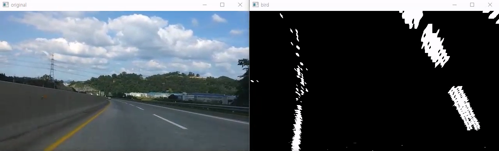

### 1.1 Usage

```
$ cd ~/carvis/Curved-Lane-Lines
$ python3 curved.py #for video simulation
$ python3 curved_sim.py #for MORAI simulation
```

### 1.2 Result

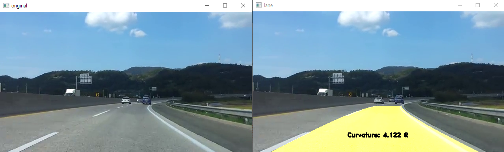
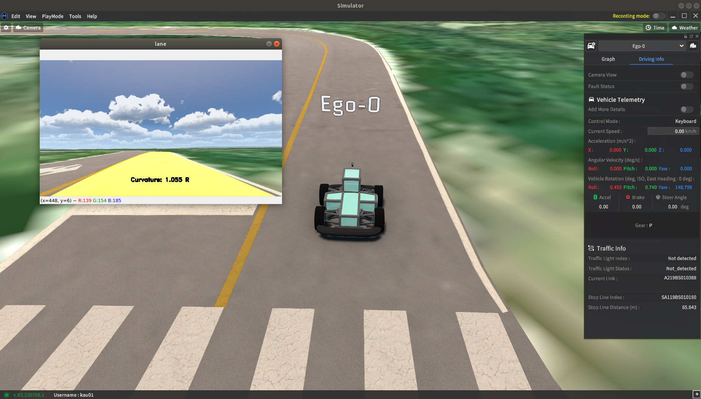
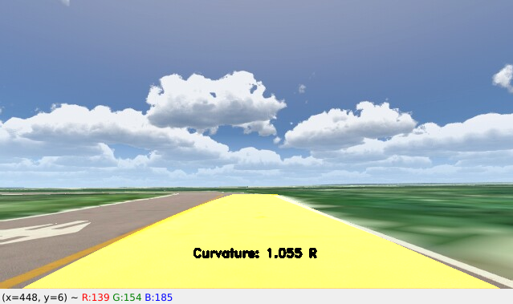

영상을 통해 직진 구간에서는 차선을 잘 인식하는 것을 확인할 수 있었으나 영상에서의 차선을 변경하는 구간이나 시뮬레이션에서는 결과 곡률 값이 매우 불안정한 것을 확인할 수 있었다. 또한 카메라의 위치와 각도에 대하여 결과값이 매우 민감한 것을 확인할 수 있었다. 따라서 실제 사용하기엔 적절하지 않다고 생각하여 아래 YOLOP를 적용하였다.

## 2. Object detection using YOLOv5

### 2.1 Data Processing

데이터셋을 받으면 데이터셋에서 제공하는 label과 YOLOv5에서 사용하는 label의 형식이 다르므로 데이터 전처리가 필요하다. AIHUB에서 사용하는 label 형식은 [xmin ymin xmax ymax]이고 YOLOv5에서 사용하는 label 형식은 [x_cent y_cent width height]이며, 0~1의 값을 가지도록 정규화되어 있다. AIHUB에서 사용하는 label을 YOLOv5 label로 바꾸는 파일은 carvis/datasets/datasets_sample 내에 있다.
다음과 같이 파일을 배치한 후 아래의 명령을 실행하면, AIHUB 데이터셋의 label을 YOLOv5 label로 변환할 수 있다.

```
dataset
├──images
│    ├──train   ← put train images here
│    └──val     ← put validation images here
├──json
│    ├──train   ← put train labels(.json) here
│    └──val     ← put validation labels(.json) here
├──labels
│    ├──train
│    └──val
└──j2y.py  ← put this file here
```
```
$ cd ~/carvis/datasets
$ python3 j2y.py
```

### 2.2 Training

다음과 같이 dataset.yaml 파일을 작성하여 yolov5/data 안에 넣는다. 여기서 path, train, val은 dataset의 경로, train과 validation data의 경로이다. nc는 class의 개수, names는 class의 이름을 넣는다.

```
path: ../datasets/ds
train: images/train
val: images/val
nc: 4  # number of classes
names: ['Red', 'Green', 'Green Arrow', 'Yellow']
```

다음 명령을 통해 학습을 수행한다.

```
$ cd ~/carvis/yolov5
$ python3 train.py --data dataset.yaml --weights '' --cfg yolov5s.yaml --img 640 --batch-size 16
```

VRAM 부족 현상으로 학습 시작 실패 시, batch-size를 조절한다.
학습 완료 시 run 폴더 안의 pt 파일을 이용하여 학습한 모델을 사용할 수 있다.

### 2.3 Usage

다음 명령을 사용하는 python 코드에 추가하면 YOLOv5를 사용할 수 있다.

```
#model = torch.hub.load('ultralytics/yolov5', 'custom', path='traffic_light.pt', force_reload=False) #online
model = torch.hub.load('yolov5','custom',path=pt,source='local') #offline
yolo = self.model(img)
df = yolo.pandas().xyxy[0]
img = yolo.render()[0]
```

df를 통해 pandas dataframe으로 detection 결과를 사용할 수 있고, render() method를 통해 사진에 detection 결과를 합쳐 이미지를 생성할 수 있다.

다음 명령을 통해 MORAI 시뮬레이션 환경에서 YOLOv5로 object detection을 할 수 있다.

```
$ cd ~/carvis/yolov5
$ python3 yolo_sim.py
```

### 2.4 Result

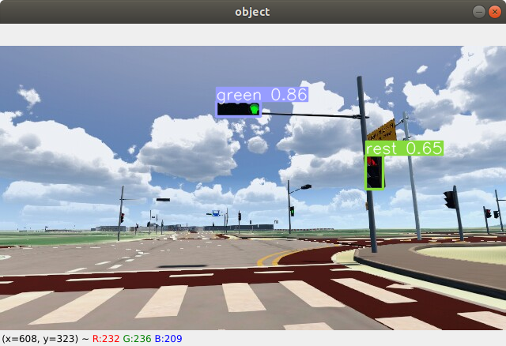
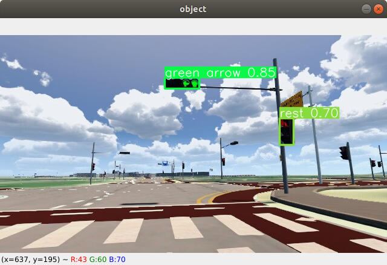
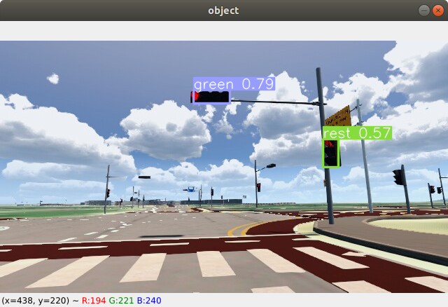

학습 결과 두 데이터셋 모두 직진과 직좌 신호등은 잘 인식하였으나, 적색 신호를 잘 인식하지 못하였다. 데이터셋 확인 결과 청색 신호에 비해 적색 신호의 학습량이 적은 것을 확인할 수 있었다. 적색 신호 데이터를 더 확보한 후, Stratify를 이용하여 데이터 수를 일치시킬 필요성이 있다.

## 3. Object detection using Darknet_ROS

### 3.1 Installation

```
$ cd catkin_ws/src
$ git clone --recursive git@github.com:leggedrobotics/darknet_ros.git
```

여기에서 CMakeList.txt를 주의하여야 된다. 일단은 보통의 이러한 프로그램을 돌리기 위해서는 computing 성능이 병렬적으로 필요하기 때문에 gpu를 많이 쓰게 된다.
먼저 본인의 gpu 성능을 검색하여야 된다. 본인의 gpu가 무엇인지 알게 되었다면, 구글에 ex) gtx 1060 computing capability라고 검색을 한다면 다음의 화면을 볼 수 있을 것이다.

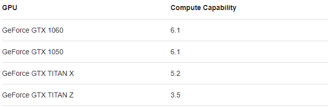

그렇다면 CMakeList.txt 파일의 다음의 줄을 유의 깊게 보면 된다(26번째 줄)

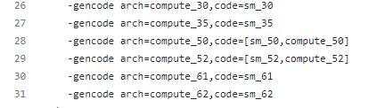

위에서 검색한 gpu의 값이 6.1이라면 30을 지우고 61로 설정을 해준 후 make 해주어야 제대로 compile이 될 것이다. 만약 gpu를 사용하지 않는다고 가정한다면 #을 이용하여 26번째 줄을 주석 처리해 준다면 cpu 만으로 yolo를 실행할 수 있게 된다. cuda를 잘 export 해주고, gpu 설정을 잘 하였다고 가정한 후 26번째 줄까지 고쳤다고 생각을 한다면, 다음의 두 명령어를 통하여 compile을 해준다.

```
$ cd
$ cd catkin_ws
$ catkin_make -DCMAKE_BUILD_TYPE=Release
$ catkin build darnet_ros -DCMAKE_BLUID_TYPE=Release
```
### 3.2 Train & Usage
실시간으로 데이터를 받아서 물체를 탐지하기 위하여 cam의 정보를 읽어드릴 필요가 있다.
darknet_ros/darknet_ros/launch/darknet_ros.launch 파일의 6번째 줄의 default 안의 내용을 다음처럼 사용하는 topic으로 수정해 준다.
`<arg name="image" default="/camera/rgb/image_raw" />`
`<arg name="image" default="/camera/color/image_raw" />`
`<arg name="image" default="/camera/color/image_raw/compressed" />`
launch file에서 다음의 줄을 수정해 주어야 된다.

```
 8  <!-- Config and weights folder. -->
 9  <arg name="yolo_weights_path"    default="$(find darknet_ros)/yolo_network_config/weights"/>
10  <arg name="yolo_config_path"     default="$(find darknet_ros)/yolo_network_config/cfg"/>
```

위의 yolo_network_config/weights(cfg) 뒤에 내가 작성한 파일을 넣어 주어야 된다.( / 붙인 후에 넣어야 directory 명이 제대로 설정될 것이다.) weigths와 cfg라는 것이 여기서 두 가지가 존재하는 데 편의를 위해서 ros 용 darknet 용이라고 명명하겠다. yolo_network_config 폴더 안에 들어가 본다면 weights와 cfg가 있는데 이는 모두 darknet 용이다 즉 학습을 시킬 때 사용했던 파일들이다.
마지막으로는 config 파일에 있는 yaml 파일을 바꿔주면 되는데, 이때 yaml 파일은 다음 과 같은 구조로 이루어져 있다.

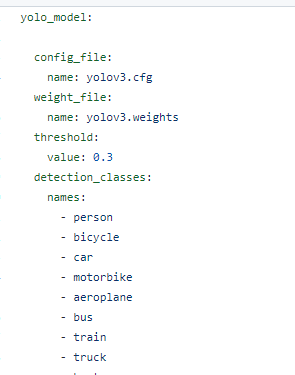

config_file 은 위에 darknet 용 cfg 파일과 weight_file은 darknet 용 weight 파일을 넣어준다.
threshold는 객체를 탐지할 때 그 객체일 확률이 output으로 나타나게 되는데 이때 어느 정도의 확률인지 값을 입력해 주면 그 확률 이상의 객체만을 탐지하게 된다. (ex) 50% 이상만 추출을 원함 value: 0.5)
마지막으로 컴퓨터가 인식하는 내용은 0~n까지의 숫자 값을 class 넘버를 표현하게 되는데 이때의 객체의 이름을 적어주면 된다.
darknet을 이용하여 yolo를 학습할 때에 names 파일과 동일한 순서대로 적어주면 된다.
마지막으로 명령창에 다음과 같이 명령어를 입력하여 주면 값을 잘 출력하는지 확인할 수 있다.
`roslaunch darknet_ros darknet_ros.launch`

## 4. Advanced lane detection using YOLOP

### 4.1 Usage

```
$ cd ~/carvis/YOLOP
$ python3 yolop_opt.py
```

### 4.2 Result

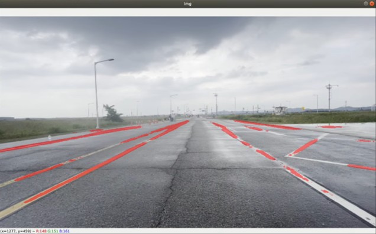
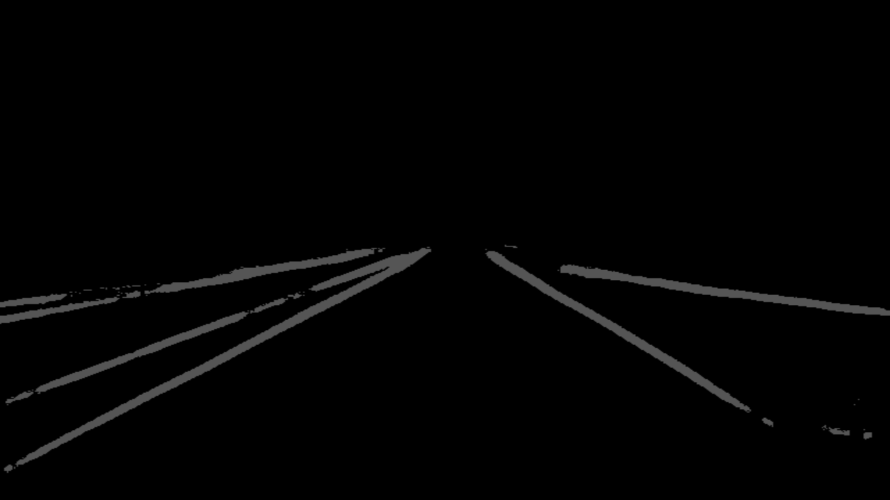
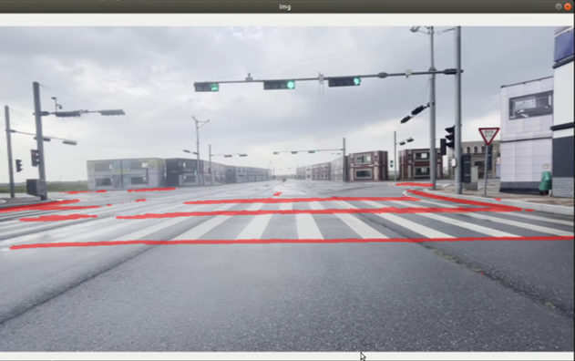

차선 인식이 매우 잘 되는것을 확인할 수 있었다. 다만 YOLOv5와 YOLOP를 동시에 실행하여 object detection과 lane detection을 따로 수행하여 CPU만으로 처리하면 delay가 2~3초 정도 발생하는 것을 확인할 수 있었다. GPU를 사용하는 것을 권장한다.

**Datasets:**

[AI HUB 신호등/도로표지판 인지 영상(수도권 외)](https://aihub.or.kr/aihubdata/data/view.do?currMenu=115&topMenu=100&aihubDataSe=realm&dataSetSn=188)

[ETRI 신호등 데이터셋](https://nanum.etri.re.kr/share/kimjy/etri_traffic_light)

**Referece:**

[Curved Lane Lines](https://github.com/kemfic/Curved-Lane-Lines)

[YOLOv5](https://github.com/ultralytics/yolov5)

[YOLO ROS](https://github.com/leggedrobotics/darknet_ros/tree/master/darknet_ros)

[YOLOP](https://github.com/hustvl/YOLOP)
